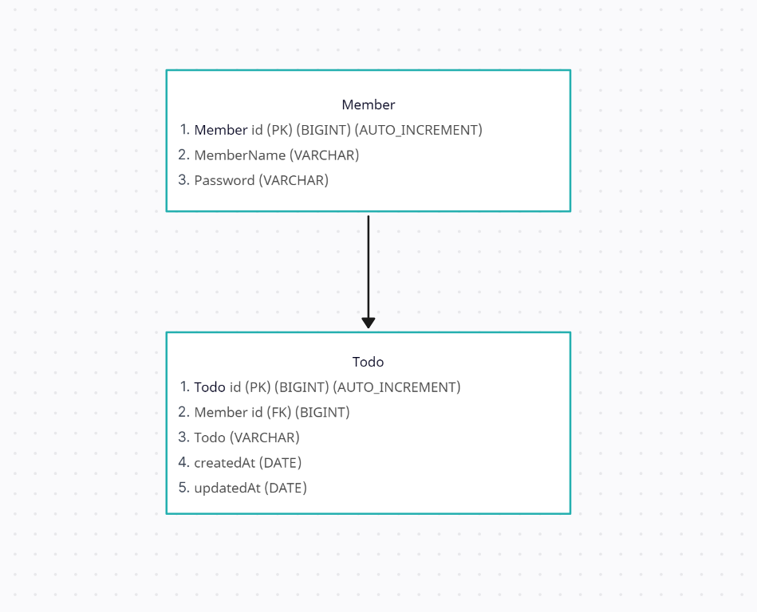

[ 전체적인 로직 작성 순서]
1. 순수 자바로 먼저 기능 구현
2. exception 생각 x - 일단 돌아가게 먼저 만들기
3. jdbc,sql,db 연동하여 기능 바꾸기

[ API 명세서 ]

| 기능 | Method | URL                    | request | response | 상태코드 |
| --- | --- |------------------------| --- | --- | --- |
| 일정 전체 조회 | GET | /api/calendar          | 요청 | 다건 응답 | 200: 정상조회 |
| 일정 단일 조회 (아이디) | GET | /api/calendar/{id}     | 요청 path | 단일 응답 | 200: 정상조회 |
| 일정 전체 조회 (수정일) | GET | /api/calendar/updateAt | 요청 param | 다건 응답 | 200: 정상조회 |
| 일정 전체 조회 (담당자) | GET | /api/calendar/author   | 요청 param | 다건 응답 | 200: 정상조회 |
| 일정 생성 | POST | /api/calendar          | 요청 body | 단일 생성 정보 | 200: 정상등록 |
| 일정 업데이트 | PUT | /api/calendar/{id}     | 요청 path, body | 단일 수정 정보 | 200: 정상수정 |
| 일정 삭제 | DELETE | /api/calendar/{id}     | 요청 path | 단일 삭제 정보 | 200: 정상삭제 |

[ ERD ]

